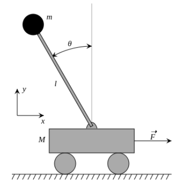
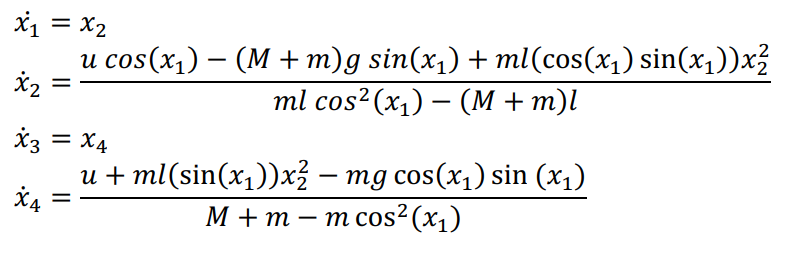
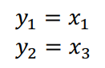
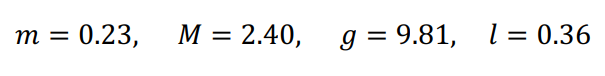
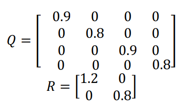

# Kalman-Filter-Extensions

## introduction
**Implementations of Extended Kalman Filter (EKF), Unscented Kalman Filter (UKF), and Particle Filter (PF) with jax.**

This repository heavily relies on [jax.vamp](https://ericmjl.github.io/dl-workshop/02-jax-idioms/01-loopless-loops.html) and [jax.lax.scan](https://ericmjl.github.io/dl-workshop/02-jax-idioms/02-loopy-carry.html). These two operation significantly boost the computation speed (2 or 3x faster than numpy naive implementation) and enable GPU acceleration for parallel computations.

## System
### Diagram
The system is shown in the figure below:



### Equations
And nonlinear state space equations are:



With the output equations as:



### Parameters
Considering states with zero initial values and model's parameters as following:



Discretization of the model has been done with 1ms sampling interval. And the Process (Q) and Measurement (R) noises are added to system equations with the following covariance matrices:



## Code Structure
Kalman-Filter-Extensions/<br>
  ├── argparser.py<br>
  ├── create_load.py<br>
  ├── function.py<br>
  ├── main.py<br>
  ├── plot.py<br>
  ├── Models/<br>
  │   &emsp;&emsp;&emsp;└── extended_kalman_filter.py<br>
  │     &emsp;&emsp;&emsp;└── particle_filter.py<br>
  │     &emsp;&emsp;&emsp;└── unscented_kalman_filter.py

**argparser.py:** Contains parameters.<br>
**create_load.py:** File to generate/load the dataset.<br>
**function.py:** Defines the function.<br>
**main.py:** Main file to run the code.<br>
**plot.py:** A self defined logger.<br>
**Models:** This folder contains implementations of EKF, UKF, and PF.<br>

## Usage
Download this repository and use:
````
 python main.py
````
 
This will automatically plots the true values agains EKF and UKF estimations and prints the RMSE error for each state.

